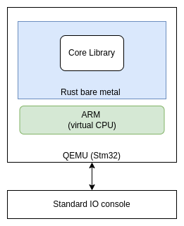

# Rust STM32 UART Programming

This tutorial is base on qemu simulation of STM32 to run Rust bare metal code.

## What are we building here ?

We are building rust bare metal code, that can run on ARM core of STM32 microcontroller.
To avoid hardware requirement, let simulate same thing inside qemu (open source simulator) as shown below.

